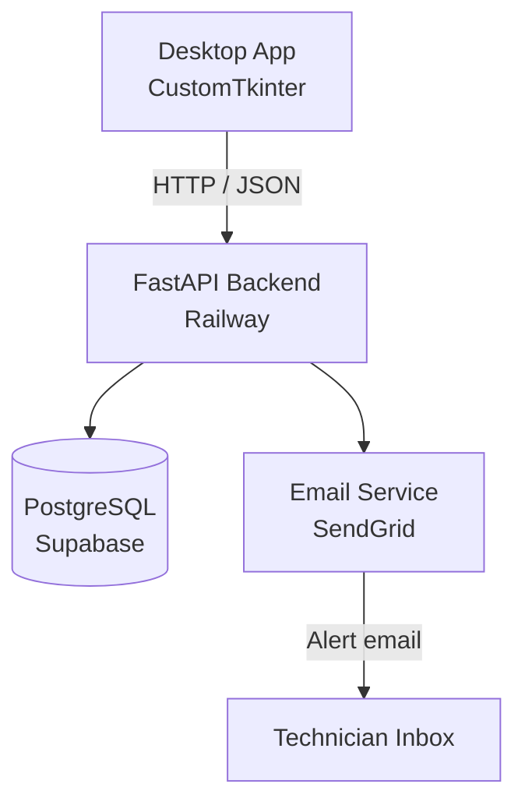

# CLAUDE.md — FieldLog
> Complete build instructions for Claude Code. Read this entire file before writing any code.

---

## Project Overview

**FieldLog** is a desktop application for oil & gas maintenance technicians to log equipment issues, track maintenance history, receive overdue alerts, and view basic analytics — all backed by a cloud API and database.

The app is built in two layers:
- **Desktop frontend** — Python + CustomTkinter (runs locally on the technician's machine)
- **Cloud backend** — FastAPI + PostgreSQL on Supabase (hosted, always-on API)

No login screen. The app opens directly to the dashboard. A single technician uses it.

---

## Tech Stack

| Layer | Technology |
|---|---|
| Desktop UI | Python 3.11+, CustomTkinter |
| HTTP client | `httpx` (async) |
| Backend API | FastAPI |
| Database | PostgreSQL via Supabase (free tier) |
| ORM | SQLAlchemy + asyncpg |
| Auth | JWT (backend only, auto-token on app start) |
| Email alerts | `smtplib` or SendGrid API |
| Testing | pytest + httpx AsyncClient |
| CI/CD | GitHub Actions |
| API Docs | Swagger UI at `/docs` (auto from FastAPI) |
| Deployment | Railway (backend) |

---

## Design System

### Philosophy
Clean, minimal, professional. This is a tool used in industrial environments — it should feel reliable and calm, not flashy. Lots of white space, subtle color, clear hierarchy. The interface should never feel cluttered even when data is dense.

### Color Palette
```
Background:       #F8F9FA   (near-white, slightly warm)
Surface:          #FFFFFF   (cards, panels)
Border:           #E5E7EB   (dividers, card edges)
Text Primary:     #111827   (headings, labels)
Text Secondary:   #6B7280   (subtitles, metadata)
Accent:           #1D4ED8   (primary buttons, active nav, links — steel blue)
Accent Light:     #EFF6FF   (accent backgrounds, hover states)
Success:          #16A34A   (operational status)
Warning:          #D97706   (due soon — within 7 days)
Danger:           #DC2626   (overdue, critical alerts)
Danger Light:     #FEF2F2   (alert banner backgrounds)
```

### Typography
Use system fonts for desktop (no Google Fonts dependency):
```
Headings:   "Segoe UI Semibold" / "SF Pro Display" / fallback sans-serif, weight 600
Body:       "Segoe UI" / "SF Pro Text" / fallback sans-serif, weight 400
Data/mono:  "Cascadia Code" / "Consolas" / monospace (for IDs, timestamps)
```

Type scale:
```
Page title:     20px, weight 600
Section header: 15px, weight 600, letter-spacing +0.3px
Body:           13px, weight 400
Caption/meta:   11px, weight 400, color Text Secondary
```

### Layout
- **Sidebar** (200px wide, fixed left) — navigation only, no decoration
- **Content area** (remaining width) — scrollable, padded 24px
- **Cards** — white background, 1px border (#E5E7EB), 8px border-radius, 16px padding
- **Tables** — no outer border, alternating row background (#F9FAFB on even rows)
- **Spacing unit** — 8px base. Use multiples: 8, 16, 24, 32

### Signature Element
The single memorable design detail: a **thin left-side colored border on status badges** inside cards — 3px solid, color-coded by status (green/amber/red). Not a pill badge, not a circle dot. A precise vertical rule. This gives the data table a quiet industrial precision that fits the oil & gas context without being loud about it.

### CustomTkinter Specifics
```python
ctk.set_appearance_mode("light")
ctk.set_default_color_theme("blue")

# Override defaults with the palette above using configure() on each widget
# Font: ctk.CTkFont(family="Segoe UI", size=13, weight="normal")
# Always set corner_radius=8 on cards/frames
# Use CTkScrollableFrame for lists and tables
# Sidebar: CTkFrame with fg_color="#FFFFFF", border_width=0, right border via a 1px CTkFrame separator
```

---

## Project Structure

```
fieldlog/
├── desktop/
│   ├── main.py                  # App entry point, window init
│   ├── api_client.py            # All HTTP calls to backend (httpx)
│   ├── config.py                # API base URL, app constants
│   ├── components/
│   │   ├── sidebar.py           # Navigation sidebar
│   │   ├── stat_card.py         # Reusable summary card component
│   │   ├── status_badge.py      # Color-coded status badge with left rule
│   │   └── data_table.py        # Reusable scrollable table component
│   └── screens/
│       ├── dashboard.py         # Summary stats + recent alerts
│       ├── equipment.py         # Equipment list + add/edit form
│       ├── maintenance.py       # Maintenance log list + new log form
│       └── alerts.py            # Overdue equipment list
│
├── backend/
│   ├── main.py                  # FastAPI app init, router includes
│   ├── database.py              # Supabase/PostgreSQL async connection
│   ├── models.py                # SQLAlchemy ORM models
│   ├── schemas.py               # Pydantic request/response schemas
│   ├── auth.py                  # JWT token creation + verification
│   ├── alert_service.py         # Overdue detection + email dispatch
│   └── routers/
│       ├── equipment.py         # /equipment endpoints
│       └── maintenance.py       # /maintenance endpoints
│
├── tests/
│   ├── conftest.py              # pytest fixtures, test DB setup
│   ├── test_equipment.py
│   └── test_maintenance.py
│
├── .github/
│   └── workflows/
│       └── ci.yml               # Run pytest on every push
│
├── .env.example                 # Template for environment variables
├── requirements.txt
└── README.md                    # Architecture diagram + setup guide
```

---

## Data Models

### Equipment
```python
class Equipment(Base):
    __tablename__ = "equipment"

    id: UUID (primary key, auto)
    name: str                        # e.g. "Compressor Unit C-04"
    type: str                        # compressor | pipeline | rig | pump | valve | other
    location: str                    # e.g. "Block 7 - North Field"
    status: str                      # operational | degraded | offline
    last_maintenance_date: date
    next_maintenance_due: date
    notes: str (nullable)
    created_at: datetime (auto)
```

### MaintenanceLog
```python
class MaintenanceLog(Base):
    __tablename__ = "maintenance_logs"

    id: UUID (primary key, auto)
    equipment_id: UUID (FK → equipment.id)
    performed_by: str                # technician name
    maintenance_type: str            # routine | corrective | emergency
    description: str
    parts_replaced: str (nullable)
    performed_at: datetime
    next_due_date: date
    created_at: datetime (auto)
```

---

## API Endpoints

### Equipment
```
GET    /equipment                   List all equipment (supports ?status= filter)
POST   /equipment                   Register new equipment
GET    /equipment/{id}              Get single equipment item
PUT    /equipment/{id}              Update equipment
DELETE /equipment/{id}              Delete equipment
GET    /equipment/alerts/overdue    List equipment past next_maintenance_due
```

### Maintenance
```
GET    /maintenance                 List all logs (supports ?equipment_id= filter)
POST   /maintenance                 Create new log (also updates equipment.last_maintenance_date)
GET    /maintenance/{id}            Get single log
```

### Dashboard
```
GET    /dashboard/summary           Returns: total_equipment, operational_count,
                                    overdue_count, logs_this_month
```

---

## Alert System

### In-App Alerts
- On every app launch, `api_client.py` calls `GET /equipment/alerts/overdue`
- If any results, the Alerts nav item shows a red badge with count
- The Alerts screen lists all overdue equipment with days overdue

### Email Alerts
- `alert_service.py` runs a background check via FastAPI's `lifespan` startup event
- Uses `APScheduler` to check for overdue equipment every 24 hours
- Sends email via SendGrid API (free tier: 100 emails/day)
- Email includes: equipment name, location, days overdue, last maintenance date
- Configure recipient email in `.env`

```python
# .env variables needed
SUPABASE_DATABASE_URL=postgresql+asyncpg://...
JWT_SECRET=your_secret_key
SENDGRID_API_KEY=your_key
ALERT_EMAIL_RECIPIENT=technician@company.com
API_BASE_URL=https://your-app.railway.app
```

---

## Desktop App — Screen Specs

### Dashboard (`dashboard.py`)
- 4 stat cards in a row: Total Equipment | Operational | Overdue | Logs This Month
- Each card: icon (use emoji or simple Unicode), large number, small label
- Below cards: "Recent Maintenance" — last 5 logs as a compact table
- Below that: "Overdue Alerts" — top 3 overdue items as red-accented cards

### Equipment Screen (`equipment.py`)
- Top: "Add Equipment" button (right-aligned)
- Main: scrollable table — Name | Type | Location | Status | Next Due | Actions
- Status column uses the signature left-rule badge (green/amber/red)
- Actions: Edit | Delete (small text buttons, not icon buttons)
- Clicking "Add Equipment" or "Edit" opens a modal form (CTkToplevel)

### Maintenance Log Screen (`maintenance.py`)
- Top: "Log Maintenance" button + equipment filter dropdown
- Main: scrollable table — Equipment | Type | Performed By | Date | Next Due
- Clicking "Log Maintenance" opens a modal form

### Alerts Screen (`alerts.py`)
- Red banner at top if any overdue items: "X items require immediate attention"
- Table: Equipment Name | Location | Due Date | Days Overdue | Last Maintained
- Days Overdue column: red text, bold

---

## API Client (`api_client.py`)

All backend calls go through this single file. Use `httpx.AsyncClient`.

```python
import httpx
from config import API_BASE_URL, JWT_TOKEN

class APIClient:
    def __init__(self):
        self.base = API_BASE_URL
        self.headers = {"Authorization": f"Bearer {JWT_TOKEN}"}

    async def get_equipment(self, status=None): ...
    async def create_equipment(self, data: dict): ...
    async def update_equipment(self, id: str, data: dict): ...
    async def delete_equipment(self, id: str): ...
    async def get_overdue(self): ...
    async def get_maintenance_logs(self, equipment_id=None): ...
    async def create_maintenance_log(self, data: dict): ...
    async def get_dashboard_summary(self): ...
```

Use `asyncio.run()` to call async methods from CustomTkinter event handlers.

---

## CI/CD (`.github/workflows/ci.yml`)

```yaml
name: CI

on: [push, pull_request]

jobs:
  test:
    runs-on: ubuntu-latest
    steps:
      - uses: actions/checkout@v3
      - uses: actions/setup-python@v4
        with:
          python-version: "3.11"
      - run: pip install -r requirements.txt
      - run: pytest tests/ -v
        env:
          SUPABASE_DATABASE_URL: ${{ secrets.TEST_DATABASE_URL }}
          JWT_SECRET: test_secret
```

---

## README Requirements

The README.md must include:
1. **Project description** — one paragraph, plain English
2. **Architecture diagram** — Mermaid diagram showing: Desktop App → FastAPI → PostgreSQL, plus Email Service branch
3. **Tech stack table**
4. **Setup instructions** — local backend setup, Supabase setup, running the desktop app
5. **Screenshots** — at least dashboard and equipment list
6. **API reference** — list all endpoints with method and description
7. **CI badge** — GitHub Actions status badge at the top

Mermaid diagram template:


---

## Build Order

Follow this exact order. Do not jump ahead.

1. **Backend foundation** — FastAPI app, database connection to Supabase, SQLAlchemy models, run migrations
2. **Equipment endpoints** — all CRUD routes + overdue endpoint, test manually with Swagger
3. **Maintenance endpoints** — log creation, list with filter
4. **Dashboard summary endpoint**
5. **Alert service** — overdue detection logic + email via SendGrid
6. **pytest test suite** — equipment and maintenance tests with async test client
7. **GitHub Actions CI** — wire up the workflow, confirm tests pass on push
8. **Deploy backend to Railway** — set env vars, confirm live `/docs` works
9. **Desktop app scaffold** — main window, sidebar, screen routing
10. **API client** — all methods wired to live backend
11. **Dashboard screen** — stat cards + tables
12. **Equipment screen** — table + add/edit modal
13. **Maintenance screen** — table + log modal
14. **Alerts screen** — overdue list + banner
15. **Polish** — apply full design system, spacing, typography, status badges
16. **README** — architecture diagram, screenshots, setup guide

---

## CV Bullet (copy this exactly)

> Built a full-stack desktop application for oil & gas equipment health monitoring, featuring a CustomTkinter GUI, FastAPI backend, cloud-hosted PostgreSQL database on Supabase, automated overdue alerts with email notifications via SendGrid, pytest test coverage, and CI/CD via GitHub Actions — deployed on Railway with live Swagger documentation.

---

## Project Name

**FieldLog** — Ground-level, technician-first. A log kept in the field.

- GitHub repo: `fieldlog`
- Window title: `FieldLog`
- README header: `FieldLog`

---

*Last updated: June 2026*
