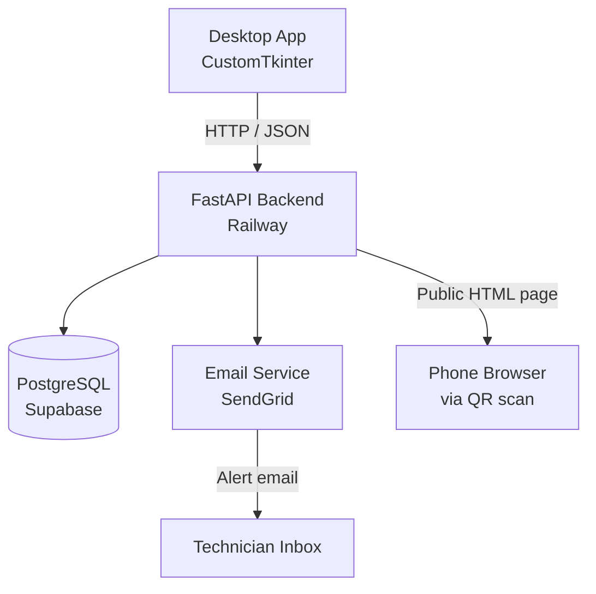

# FieldLog

[](https://github.com/Otaibi47/FieldLog/actions/workflows/ci.yml)

A full-stack desktop application for oil & gas maintenance technicians to log equipment issues, track maintenance history, receive overdue alerts, and view analytics — backed by a cloud API and PostgreSQL database hosted on Supabase and deployed on Railway.

---

## Features

| Feature | Description |
|---|---|
| Equipment Registry | Register, edit, and delete field equipment with status tracking |
| Maintenance Logs | Record maintenance events with technician, type, parts, and next-due date |
| Dashboard | Live stat cards (total, operational, overdue, logs this month) + recent activity table |
| Overdue Alerts | Sidebar badge + alert cards for equipment past its maintenance due date |
| Date Range Filter | Filter maintenance logs by preset ranges or a custom date picker |
| Technician Search | Filter maintenance logs by technician name |
| Excel Export | Styled `.xlsx` with column widths, header formatting, and alternate row shading |
| PDF Export | Branded A4 landscape report with header/footer, summary bar, and word-wrap |
| QR Codes | Every equipment entry gets a unique QR code linking to its public maintenance history page |
| Audit Log | Every create / update / delete / status change is automatically recorded and browsable |
| Dark Mode | Full dark palette (slate/blue, WCAG AA contrast throughout) |

---

## Architecture



---

## Tech Stack

| Layer | Technology |
|---|---|
| Desktop UI | Python 3.11+, CustomTkinter |
| HTTP client | httpx (async) |
| Backend API | FastAPI |
| Database | PostgreSQL via Supabase |
| ORM | SQLAlchemy 2.0 + asyncpg |
| Auth | JWT (python-jose) |
| Email alerts | SendGrid API |
| Excel export | openpyxl |
| PDF export | reportlab |
| QR codes | qrcode + Pillow |
| Testing | pytest + httpx AsyncClient |
| CI/CD | GitHub Actions |
| Deployment | Railway |

---

## Setup

### 1. Clone and install

```bash
git clone https://github.com/Otaibi47/FieldLog.git
cd FieldLog
pip install -r backend/requirements.txt
```

### 2. Configure environment

```bash
cp .env.example .env
# Edit .env with your credentials
```

### 3. Supabase setup

1. Create a free project at [supabase.com](https://supabase.com)
2. Copy the **Connection string** (URI format) from Project Settings → Database
3. Paste it as `SUPABASE_DATABASE_URL` in your `.env`

### 4. Run the backend locally

```bash
cd backend
uvicorn main:app --reload
# Swagger UI: http://localhost:8000/docs
```

Tables are created automatically on first startup (`audit_logs` included).

### 5. Run the desktop app

```bash
# From the project root:
python main.py

# Or directly:
cd desktop
python main.py
```

Set `API_BASE_URL=http://localhost:8000` in your environment (or `.env`) when running locally.  
Defaults to the live Railway deployment if not set.

### 6. Deploy backend to Railway

1. Push this repo to GitHub
2. Create a new Railway project, connect the repo
3. Set root directory to `backend/`
4. Add all `.env` variables as Railway environment variables
5. Railway auto-deploys on every push to `main`

---

## API Reference

### Equipment

| Method | Endpoint | Auth | Description |
|---|---|---|---|
| GET | `/equipment` | ✓ | List all equipment (`?status=` filter) |
| POST | `/equipment` | ✓ | Register new equipment |
| GET | `/equipment/{id}` | ✓ | Get single equipment item |
| PUT | `/equipment/{id}` | ✓ | Update equipment (status changes are audited separately) |
| DELETE | `/equipment/{id}` | ✓ | Delete equipment |
| GET | `/equipment/alerts/overdue` | ✓ | Equipment past `next_maintenance_due` |
| GET | `/equipment/{id}/history` | Public | Mobile-friendly HTML page — linked by QR code |

### Maintenance

| Method | Endpoint | Auth | Description |
|---|---|---|---|
| GET | `/maintenance` | ✓ | List all logs (`?equipment_id=` filter) |
| POST | `/maintenance` | ✓ | Create log (also updates equipment dates) |
| GET | `/maintenance/{id}` | ✓ | Get single maintenance log |

### Audit Log

| Method | Endpoint | Auth | Description |
|---|---|---|---|
| GET | `/audit` | ✓ | List audit entries, newest first (`?limit=` param, default 300) |

### Dashboard

| Method | Endpoint | Auth | Description |
|---|---|---|---|
| GET | `/dashboard/summary` | ✓ | `total_equipment`, `operational_count`, `overdue_count`, `logs_this_month` |

### Auth

| Method | Endpoint | Auth | Description |
|---|---|---|---|
| GET | `/token` | — | Fetch JWT for desktop app on startup |

Full interactive docs at `/docs` (Swagger UI) when the backend is running.

---

## QR Code Flow

1. Open the Equipment screen — each row has a **QR** button
2. Click it → dialog shows a scannable QR code and the public URL
3. Scan with any phone → opens `https://<railway-host>/equipment/{id}/history`
4. The page shows the equipment's full maintenance history, status, and next-due date — no login required

---

## Audit Log

Every state-changing action is recorded automatically:

- `created` — equipment registered or maintenance log added
- `updated` — equipment fields edited
- `status_changed` — equipment status specifically changed (tracked separately for easy filtering)
- `deleted` — equipment permanently removed

Browse the full history in the **Audit Log** screen (sidebar, last item). Filter by action type. Entries are stored in the `audit_logs` table and never deleted.

---
