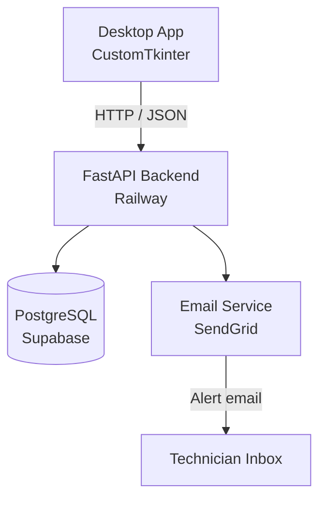

# FieldLog

[](https://github.com/yourusername/fieldlog/actions/workflows/ci.yml)

A full-stack desktop application for oil & gas maintenance technicians to log equipment issues, track maintenance history, receive overdue alerts, and view basic analytics — backed by a cloud API and PostgreSQL database hosted on Supabase and deployed on Railway.

---

## Architecture



---

## Tech Stack

| Layer | Technology |
|---|---|
| Desktop UI | Python 3.11+, CustomTkinter |
| HTTP client | httpx (async) |
| Backend API | FastAPI |
| Database | PostgreSQL via Supabase |
| ORM | SQLAlchemy 2.0 + asyncpg |
| Auth | JWT (python-jose) |
| Email alerts | SendGrid API |
| Testing | pytest + httpx AsyncClient |
| CI/CD | GitHub Actions |
| Deployment | Railway |

---

## Setup

### 1. Clone and install

```bash
git clone https://github.com/yourusername/fieldlog.git
cd fieldlog
pip install -r requirements.txt
```

### 2. Configure environment

```bash
cp .env.example .env
# Edit .env with your credentials
```

### 3. Supabase setup

1. Create a free project at [supabase.com](https://supabase.com)
2. Copy the **Connection string** (URI format) from Project Settings → Database
3. Paste it as `SUPABASE_DATABASE_URL` in your `.env`

### 4. Run the backend locally

```bash
cd backend
uvicorn main:app --reload
# Swagger UI: http://localhost:8000/docs
```

Tables are created automatically on first startup.

### 5. Run the desktop app

```bash
cd desktop
python main.py
```

Set `API_BASE_URL=http://localhost:8000` in your environment (or `.env`) when running locally.

### 6. Deploy backend to Railway

1. Push this repo to GitHub
2. Create a new Railway project, connect the repo
3. Set root directory to `backend/`
4. Add all `.env` variables as Railway environment variables
5. Railway auto-deploys on every push to `main`

---

## API Reference

### Equipment

| Method | Endpoint | Description |
|---|---|---|
| GET | `/equipment` | List all equipment (supports `?status=` filter) |
| POST | `/equipment` | Register new equipment |
| GET | `/equipment/{id}` | Get single equipment item |
| PUT | `/equipment/{id}` | Update equipment |
| DELETE | `/equipment/{id}` | Delete equipment |
| GET | `/equipment/alerts/overdue` | List equipment past next_maintenance_due |

### Maintenance

| Method | Endpoint | Description |
|---|---|---|
| GET | `/maintenance` | List all logs (supports `?equipment_id=` filter) |
| POST | `/maintenance` | Create new log (also updates equipment dates) |
| GET | `/maintenance/{id}` | Get single maintenance log |

### Dashboard

| Method | Endpoint | Description |
|---|---|---|
| GET | `/dashboard/summary` | Returns total_equipment, operational_count, overdue_count, logs_this_month |

### Auth

| Method | Endpoint | Description |
|---|---|---|
| GET | `/token` | Fetch JWT for desktop app on startup |

Full interactive docs available at `/docs` (Swagger UI) when the backend is running.

---

